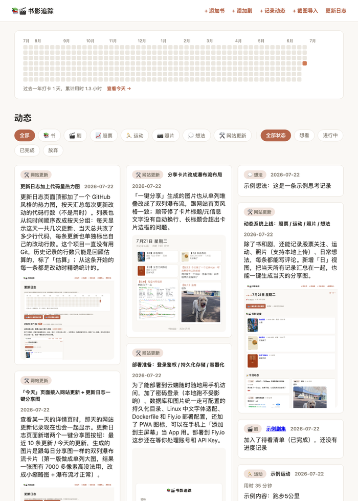

# 知行合一AI实验室

一个用 AI（Claude Code）从零搭建的个人 AI 应用实验室。目前跑在里面的第一个功能是书影/生活追踪：记录看过的书、剧，以及日常动态（股票关注、运动、照片、想法）。数据全部存在本地/私有存储，不跟踪。原名"书影追踪"。



## 功能

- **书影管理**：添加书/剧，记录每日进度、用时、感想；条目状态（想看/进行中/已完成/放弃）可以在首页直接切换
- **豆瓣自动导入**：粘贴豆瓣链接自动填充标题、封面、作者/页数或集数
- **动态记录**：股票关注、运动、照片（本地上传）、日常想法，每条都能写评论
- **统一时间线**：首页把书影进度更新和动态按日期合并成一条瀑布流，未看完的书剧每次更新都会重新出现在当天，滚动到底自动加载更多
- **全站搜索**：搜书名、作者、总评、每日感想、动态内容
- **打卡热力图**：GitHub 风格的每日活动热力图
- **AI 截图识别导入**：上传朋友圈截图，用 Claude 视觉模型自动识别文字、判断类型、草拟内容，确认后批量保存
- **一键分享图**：单条目 / 按天，生成适合发小红书的图片卡片（瀑布流排版）
- **更新日志**：网站自带 `/changelog` 页面，记录开发过程，还有代码量热力图（见下方"更新日志"）
- **性能指标**：登录后可看 `/admin/metrics`，实时 QPS / 延迟分位数 / 按接口拆分统计，更新日志页也有一个精简的公开摘要
- **小说**：`/novels`，写小说、按章节管理，配人物角色概念图和 AI 生成的视频（支持直接上传或粘贴 B 站/YouTube 链接），这部分内容不需要登录也能看，只有创作需要登录
- **密码登录 + 持久化存储**：为部署到公网准备的登录鉴权和数据持久化方案
- **PWA**：可以在手机浏览器里"添加到主屏幕"，像 App 一样用

## 技术栈

Flask + SQLite，服务端渲染（Jinja 模板 + 手写 CSS，没有前端构建流程）。Pillow 用来生成分享卡片图片。豆瓣抓取用 `requests` + `BeautifulSoup`。AI 截图识别接的是 Anthropic 的 Claude API。

## 本地运行

```bash
python3 -m venv venv
./venv/bin/pip install -r requirements.txt
./run.sh
```

打开 http://127.0.0.1:5050 即可。首次启动会自动建好本地 SQLite 数据库。

可选功能需要配置 `.env`（参考 `.env.example`）：

- `ANTHROPIC_API_KEY`：开启「AI 截图识别导入」
- `APP_PASSWORD` / `SECRET_KEY`：部署到公网时开启密码登录

## 部署

用 `Dockerfile` 构建，部署在 [Railway](https://railway.app) 上（网页操作为主，从 GitHub 仓库直接连自动部署）。持久化数据存在挂载到 `/data` 的卷里，`APP_PASSWORD` / `SECRET_KEY` 通过环境变量配置。

（此前也评估过 Fly.io，配置文件 `fly.toml` 还留着，但新账号触发了风控验证，改走了更省事的 Railway。）

## 更新日志

网站里有一个更完整的 [`/changelog`](templates/changelog.html) 页面（含代码量热力图、每日分享图），这里是精简版：

- **2026-07-24** · 章节正文加了禁止选中/复制/右键
- **2026-07-24** · 人物角色可以编辑/替换概念图，章节里自动同步
- **2026-07-24** · 章节目录改成一排 3 个的网格排版
- **2026-07-24** · 重做：人物立绘改成读到名字时才出现，不是开头
- **2026-07-24** · 修复：立绘出场动画因为没有延迟，播放太快看不出来
- **2026-07-24** · 立绘显示完整、放大，出场时轻微动画登场
- **2026-07-24** · 小说章节可以挑选出场人物和视频，人物做成立绘展示
- **2026-07-24** · 上线小说功能：章节、人物概念图、AI 视频，全部公开可看
- **2026-07-24** · 修复热力图和架构图在手机上显示不全的问题
- **2026-07-24** · 首页加了一张详细的技术架构图
- **2026-07-24** · 加了性能指标：延迟和 QPS
- **2026-07-24** · 服务器迁到新加坡机房，开启 CDN 缓存
- **2026-07-24** · 实测了一下性能优化的效果
- **2026-07-23** · 性能优化：缓存豆瓣封面、开启压缩
- **2026-07-23** · 加了传统开发流程对比图
- **2026-07-23** · 更新定位文案：从「书影/生活追踪」到「个人AI应用实验室」
- **2026-07-23** · 公开首页加了开发流程示意图
- **2026-07-23** · 修复服务器时区导致的日期错位
- **2026-07-23** · 首页对未登录访客改成公开的更新日志 + 登录入口
- **2026-07-23** · 更新日志页面对所有人公开，其余页面仍需登录
- **2026-07-23** · 加了全站搜索
- **2026-07-23** · 滚动加载扩展到全站，首页排序也调整了
- **2026-07-22** · 首页改成瀑布流分页：一开始只加载 20 条
- **2026-07-22** · 网站正式上线，修好了 Railway 自动部署
- **2026-07-22** · 上传图片自动压缩
- **2026-07-22** · 更新日志页面支持中英双语
- **2026-07-22** · 网站更名为「知行合一AI实验室」
- **2026-07-22** · 更新日志分享图里也加上代码量热力图
- **2026-07-22** · 更新日志加上代码量热力图
- **2026-07-22** · 「今天」页面接入网站更新 + 更新日志一键分享图
- **2026-07-22** · 更新日志页面上线，并接入首页动态流
- **2026-07-22** · 一批图片显示问题修复
- **2026-07-22** · 分享卡片改成瀑布流布局
- **2026-07-22** · 部署准备：登录鉴权 / 持久化存储 / 容器化
- **2026-07-22** · 首页重做：合并成统一瀑布流时间线
- **2026-07-22** · AI 截图识别导入
- **2026-07-22** · 动态系统上线：股票 / 运动 / 照片 / 想法
- **2026-07-21** · 豆瓣自动导入
- **2026-07-21** · 条目管理增强
- **2026-07-21** · 项目起步：书影追踪网站上线

> 这个列表会随每次更新同步维护，完整说明和截图看网站里的更新日志页面。
