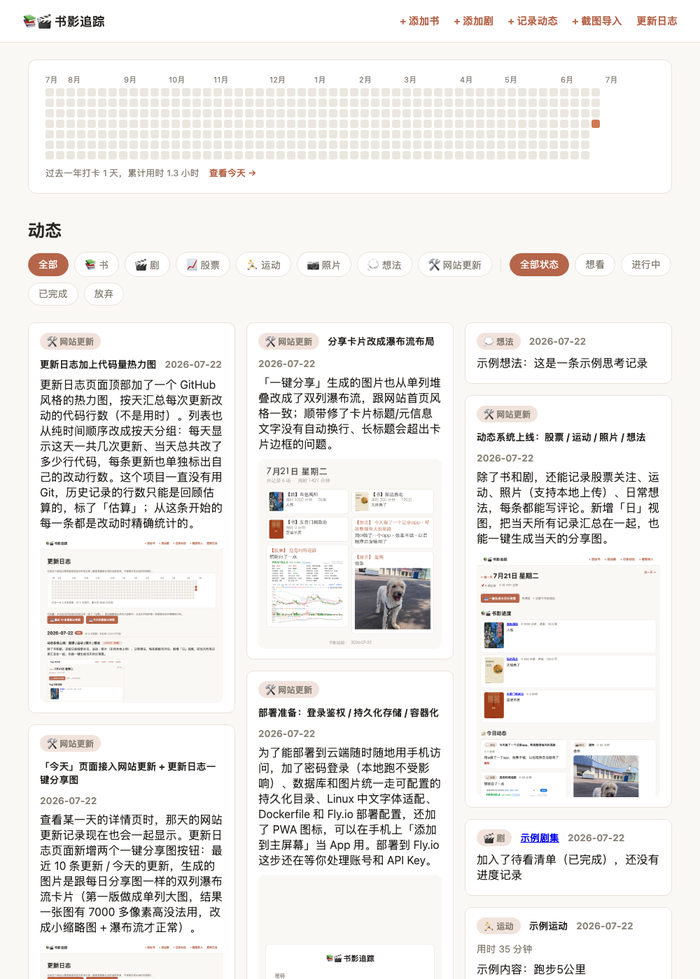

# 知行合一AI实验室

一个用 AI（Claude Code）从零搭建的个人 AI 应用实验室。目前跑在里面的第一个功能是书影/生活追踪：记录看过的书、剧，以及日常动态（股票关注、运动、照片、想法）。数据全部存在本地/私有存储，不跟踪。原名"书影追踪"。



## 功能

- **书影管理**：添加书/剧，记录每日进度、用时、感想；条目状态（想看/进行中/已完成/放弃）可以在首页直接切换
- **豆瓣自动导入**：粘贴豆瓣链接自动填充标题、封面、作者/页数或集数
- **动态记录**：股票关注、运动、照片（本地上传）、日常想法，每条都能写评论
- **统一时间线**：首页把书影进度更新和动态按日期合并成一条瀑布流，未看完的书剧每次更新都会重新出现在当天，滚动到底自动加载更多
- **全站搜索**：搜书名、作者、总评、每日感想、动态内容
- **打卡热力图**：GitHub 风格的每日活动热力图
- **AI 截图识别导入**：上传朋友圈截图，用 Claude 视觉模型自动识别文字、判断类型、草拟内容，确认后批量保存
- **一键分享图**：单条目 / 按天，生成适合发小红书的图片卡片（瀑布流排版）
- **更新日志**：网站自带 `/changelog` 页面，记录开发过程，还有代码量热力图（见下方"更新日志"）
- **性能指标**：登录后可看 `/admin/metrics`，实时 QPS / 延迟分位数 / 按接口拆分统计，更新日志页也有一个精简的公开摘要
- **小说**：`/novels`，写小说、按章节管理，章节还能归到有名字的卷里，配人物角色概念图和 AI 生成的视频（支持直接上传或粘贴 B 站/YouTube 链接），章节里可以挑选出场人物/视频、参考书目从已有书影里选，还有一键分享图，也能整本导出成 Word / PDF（导出会带卷标题），章节页还能用浏览器自带的语音朗读；小说和单个章节都可以单独上锁，锁定后未登录看不了；这部分内容默认不需要登录也能看，创作、导出、朗读和被锁定的内容都需要登录
- **多账号系统 + 持久化存储**：账号登录（不再是共享密码），每个账号的书影/动态/小说数据互相隔离；管理员能在 `/admin/users` 后台加账号、开关自助注册、下载全站数据的完整备份 zip、帮账号重置密码（直接改或发一次性重置链接）
- **中英双语**：导航栏有 中文/EN 切换，点一次全站记住；从公开首页到日常记录到小说创作到后台管理，界面文字全部支持中英切换。只翻界面文字，自己写的书影感想/动态/小说正文永远保持原文，不会被机器翻译
- **交易盈亏**：`/trading`，上传 Schwab 导出的交易记录 CSV，按 FIFO 把开仓/平仓自动配对算出每日已实现盈亏，生成盈亏日历（周一到周五，绿涨红跌）和累计盈亏走势图，统计里能看到毛利润/手续费/净利润的拆分；可以陆续上传新导出的文件追加历史，重复的交易会自动跳过；需要登录
- **消费追踪**：`/expenses`，上传工商银行「历史明细」PDF（带密码），生成消费日历（周日到周六）、按银行给的摘要分类做支出小计、按月收支汇总；同样支持陆续追加、自动去重；需要登录
- **PWA**：可以在手机浏览器里"添加到主屏幕"，像 App 一样用

## 技术栈

Flask + SQLite，服务端渲染（Jinja 模板 + 手写 CSS，没有前端构建流程）。Pillow 用来生成分享卡片图片。豆瓣抓取用 `requests` + `BeautifulSoup`。AI 截图识别接的是 Anthropic 的 Claude API。银行流水 PDF 解析用 `pdfplumber`（含密码解密、按字符渲染属性过滤防伪水印）。

## 本地运行

```bash
python3 -m venv venv
./venv/bin/pip install -r requirements.txt
./run.sh
```

打开 http://127.0.0.1:5050 即可。首次启动会自动建好本地 SQLite 数据库。

可选功能需要配置 `.env`（参考 `.env.example`）：

- `ANTHROPIC_API_KEY`：开启「AI 截图识别导入」
- `APP_PASSWORD` / `SECRET_KEY`：部署到公网时开启密码登录

## 部署

用 `Dockerfile` 构建，部署在 [Railway](https://railway.app) 上（网页操作为主，从 GitHub 仓库直接连自动部署）。持久化数据存在挂载到 `/data` 的卷里，`APP_PASSWORD` / `SECRET_KEY` 通过环境变量配置。

（此前也评估过 Fly.io，配置文件 `fly.toml` 还留着，但新账号触发了风控验证，改走了更省事的 Railway。）

## 更新日志

网站里有一个更完整的 [`/changelog`](templates/changelog.html) 页面（含代码量热力图、每日分享图），这里是精简版：

- **2026-08-07** · 新功能：上传银行卡流水 PDF，追踪日常消费
- **2026-08-07** · 交易盈亏页加了手续费统计、日历缩小了、加了各月盈亏汇总
- **2026-08-07** · 新功能：上传券商交易记录，自动算出每日盈亏日历和走势图
- **2026-08-07** · 英文版收尾：小说创作表单和后台管理页也翻完了，全站中英双语上线
- **2026-08-07** · 英文版第二步：日常使用页面（首页动态流、加书、写动态）也能切英文了
- **2026-08-07** · 英文版第一步：公开页面（首页、小说、登录）能切成英文了
- **2026-08-04** · 小说章节编辑框改成跟阅读页一样宽、一样大字号
- **2026-08-03** · 忘记密码怎么办：管理员可以帮账号重置密码了
- **2026-08-03** · 管理员后台加了「下载完整备份」
- **2026-08-03** · 多用户系统收尾：开放自助注册
- **2026-08-03** · 多用户系统第五步：后台加了账号管理页面
- **2026-08-03** · 多用户系统第四步：小说也按账号隔离，锁定改成只有作者能看
- **2026-08-03** · 多用户系统第三步：书影/动态数据按账号隔离
- **2026-08-03** · 小说分享图上也显示卷和总字数了
- **2026-08-03** · 小说章节可以批量移卷了
- **2026-08-03** · 小说章节可以归入卷了，每卷可以起名字
- **2026-08-02** · 添加书、添加剧、记录动态合并成一个入口
- **2026-07-31** · 修复：朗读点暂停后过一会儿会自己继续念
- **2026-07-31** · 朗读功能改成需要登录
- **2026-07-31** · 修复：朗读功能点「停止」不管用
- **2026-07-31** · 修复：章节页朗读按钮太挤、「停止」看不清
- **2026-07-31** · 小说章节页加了朗读功能
- **2026-07-27** · 修复：批量锁定/解锁按钮文字看不清
- **2026-07-27** · 小说加了字数统计和更新时间
- **2026-07-27** · 多用户系统第二步：登录方式换成账号+密码
- **2026-07-27** · 多用户系统第一步：数据库打好底子，网站行为不变
- **2026-07-27** · 小说编辑页可以批量锁定/解锁章节了
- **2026-07-27** · 锁定的章节改成显示前几段预览，不再直接跳登录页
- **2026-07-27** · 小说和章节都可以单独上锁，未登录看不了
- **2026-07-27** · 小说章节加了分享图，正文全文都会显示
- **2026-07-26** · 修复：小说章节标题太长时显示不全
- **2026-07-26** · 修复：小说导出的 PDF 中文乱码
- **2026-07-26** · 小说加了导出 Word / PDF（需要登录）
- **2026-07-26** · 修复：小说章节正文在手机上仍然能长按复制
- **2026-07-25** · 更新日志页面加了搜索框
- **2026-07-25** · 修复：小说分享图生成慢，豆瓣封面图现在也走磁盘缓存
- **2026-07-25** · 分享图重新设计：封面放大，去掉简介和人物，参考书目改成手动挑选
- **2026-07-25** · 没上传封面时，占位图标不再孤零零飘在空色块里
- **2026-07-25** · 参考书目的封面图缩小了一些
- **2026-07-25** · 修复：今天新加的书没写进度/评论时，查看今天看不到
- **2026-07-25** · 章节里选人物和视频也改成搜索添加
- **2026-07-25** · 参考书目改成搜索补全，不再把所有书都列出来
- **2026-07-25** · 登录页加了「返回公开主页」链接
- **2026-07-25** · 更新首页的技术架构图，补上这几轮新增的部分
- **2026-07-25** · 更新日志页面改成按天查看，加了日期选择器
- **2026-07-25** · 公开首页去掉分享图按钮和站点状态卡片
- **2026-07-25** · 公开首页的更新日志只显示今天的
- **2026-07-25** · 更新日志分享图链接也加上版本号，避开旧缓存
- **2026-07-25** · 性能优化：让图片走 CDN 缓存、图片懒加载、数据库加索引
- **2026-07-25** · 修复：未登录时参考书目封面显示不出来
- **2026-07-24** · 分享图链接加上版本号，避开已经卡住的旧缓存
- **2026-07-24** · 修复：所有分享图被 CDN 缓存 30 天，改完看不到最新效果
- **2026-07-24** · 修复：分享图简介每行末尾多了个缺字方块
- **2026-07-24** · 修复：小说简介换行会导致分享图 500 报错
- **2026-07-24** · 小说主页加了一键分享图，含封面/简介/人物/章节/书目
- **2026-07-24** · 参考书目改成从已有书目里选，不用重新录入
- **2026-07-24** · 小说主页加了参考书目，粘贴豆瓣链接自动填充
- **2026-07-24** · 章节正文加了禁止选中/复制/右键
- **2026-07-24** · 人物角色可以编辑/替换概念图，章节里自动同步
- **2026-07-24** · 章节目录改成一排 3 个的网格排版
- **2026-07-24** · 重做：人物立绘改成读到名字时才出现，不是开头
- **2026-07-24** · 修复：立绘出场动画因为没有延迟，播放太快看不出来
- **2026-07-24** · 立绘显示完整、放大，出场时轻微动画登场
- **2026-07-24** · 小说章节可以挑选出场人物和视频，人物做成立绘展示
- **2026-07-24** · 上线小说功能：章节、人物概念图、AI 视频，全部公开可看
- **2026-07-24** · 修复热力图和架构图在手机上显示不全的问题
- **2026-07-24** · 首页加了一张详细的技术架构图
- **2026-07-24** · 加了性能指标：延迟和 QPS
- **2026-07-24** · 服务器迁到新加坡机房，开启 CDN 缓存
- **2026-07-24** · 实测了一下性能优化的效果
- **2026-07-23** · 性能优化：缓存豆瓣封面、开启压缩
- **2026-07-23** · 加了传统开发流程对比图
- **2026-07-23** · 更新定位文案：从「书影/生活追踪」到「个人AI应用实验室」
- **2026-07-23** · 公开首页加了开发流程示意图
- **2026-07-23** · 修复服务器时区导致的日期错位
- **2026-07-23** · 首页对未登录访客改成公开的更新日志 + 登录入口
- **2026-07-23** · 更新日志页面对所有人公开，其余页面仍需登录
- **2026-07-23** · 加了全站搜索
- **2026-07-23** · 滚动加载扩展到全站，首页排序也调整了
- **2026-07-22** · 首页改成瀑布流分页：一开始只加载 20 条
- **2026-07-22** · 网站正式上线，修好了 Railway 自动部署
- **2026-07-22** · 上传图片自动压缩
- **2026-07-22** · 更新日志页面支持中英双语
- **2026-07-22** · 网站更名为「知行合一AI实验室」
- **2026-07-22** · 更新日志分享图里也加上代码量热力图
- **2026-07-22** · 更新日志加上代码量热力图
- **2026-07-22** · 「今天」页面接入网站更新 + 更新日志一键分享图
- **2026-07-22** · 更新日志页面上线，并接入首页动态流
- **2026-07-22** · 一批图片显示问题修复
- **2026-07-22** · 分享卡片改成瀑布流布局
- **2026-07-22** · 部署准备：登录鉴权 / 持久化存储 / 容器化
- **2026-07-22** · 首页重做：合并成统一瀑布流时间线
- **2026-07-22** · AI 截图识别导入
- **2026-07-22** · 动态系统上线：股票 / 运动 / 照片 / 想法
- **2026-07-21** · 豆瓣自动导入
- **2026-07-21** · 条目管理增强
- **2026-07-21** · 项目起步：书影追踪网站上线

> 这个列表会随每次更新同步维护，完整说明和截图看网站里的更新日志页面。
